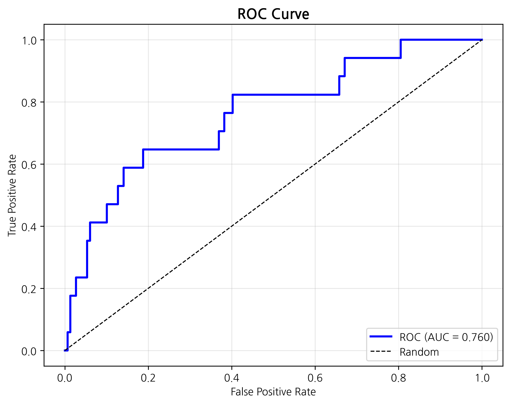

# 🏥 Topo-Nomad: TDA 기반 의료 유목민 탐지 모델
> **HIRA 청구 데이터와 위상수학(TDA)을 결합하여 '숨겨진 악성 의료 쇼핑'을 찾아내다.**

---

## 📄 기술 백서 (White Paper)
이 프로젝트의 수리적 배경과 상세 분석 결과는 아래 백서에서 확인하실 수 있습니다.

[👉 **Download Technical White Paper (PDF)**](./docs/T_NOMAD_final.pdf)

---

## 📌 프로젝트 개요 (Overview)
**Topo-Nomad**는 기존의 단순 통계적 방법(방문 횟수 등)으로는 잡아낼 수 없었던 **'위장형 의료 유목민(Camouflaged Nomads)'**을 식별하기 위한 프로젝트입니다.

* **문제점:** 단순히 병원을 많이 간다고 '악성'이 아닙니다. 합리적 탐색(Refugee)과 악성 쇼핑(Shopper)을 구분해야 합니다.
* **솔루션:** 환자의 진료 여정을 **시간과 비용의 축(Lens)** 위에서 위상학적 지도(Topological Map)로 그려내어, **'죽음의 루프(Loop)'** 구조를 찾아냈습니다.

## 🔍 핵심 성과 (Key Results)

### 1. 108명의 '숨겨진' 유목민 식별
기존 선형 분석(PCA)이 놓쳤던 환자들을 **TDA Mapper**를 통해 구조적으로 발굴했습니다.
* **Loop Group:** 108명 (상위 13%) - *High Risk*
* **특징:** 이들은 특정 병원에 뭉쳐있지 않고, 정상인들 틈에 섞여 있습니다 (**High Dispersion**).

### 2. 모델 성능 (Performance)
데이터 누수(Leakage) 요인을 제거한 상태에서도 높은 예측 정확도를 달성했습니다.
* **AUROC:** **0.91**
* **Accuracy:** 90.3%

*(위상학적 특징을 포함했을 때 모델의 성능이 비약적으로 상승함을 보여줍니다.)*

### 3. 원인 규명 (Explainable AI)
SHAP 분석 결과, 악성 유목의 가장 큰 원인은 **'총 내원 일수(Chronicity)'**였습니다.

---

## 🛠️ 분석 파이프라인 (Pipeline)
1.  **Data Ingestion:** HIRA 청구 데이터 (T200, T300, T400, T530)
2.  **Preprocessing:** **NES v2.0** 지수 산출 및 **Shadow Tracking** (비급여 추적)
3.  **TDA Modeling:** KeplerMapper를 이용한 진료 여정 지도 구축
4.  **Prediction:** XGBoost Classifier & SHAP Interpretation

---

## 👨‍💻 Team Permillion
* **Lucius (Hwang Dohyun):** Pipeline QA, TDA Optimization
* **Eunho Choi:** Pipeline Architect
* **Taekhoon Kim:** Benchmark Analyst
* **Minhyeong Jo:** Data Auditor

---
*Created for HIRA Industry-Academic Project 2026*